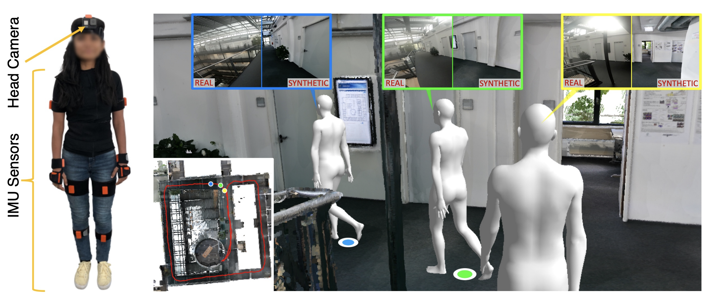

# Human POSEitioning System (HPS): 3D Human Pose Estimation and Self-localization in Large Scenes from Body-Mounted Sensors
>[Human POSEitioning System (HPS): 3D Human Pose Estimation and Self-localization in Large Scenes from Body-Mounted Sensors](https://arxiv.org/abs/2103.17265)  
[Vladimir Guzov*](https://virtualhumans.mpi-inf.mpg.de/people/guzov.html), [Aymen Mir*](https://virtualhumans.mpi-inf.mpg.de/people/Mir.html), [Torsten Sattler](https://tsattler.github.io/)  , [Gerard Pons-Moll](https://virtualhumans.mpi-inf.mpg.de/people/pons-moll.html)  
*Proceedings of IEEE Conference on Computer Vision and Pattern Recognition 2021*

>(* joint first authors with equal contribution)




 HPS jointly estimates the full 3D human pose and location of a subject within large 3D scenes, using only
wearable sensors. Left: subject wearing IMUs and a head mounted camera. Right: using the camera, HPS localizes the human in a pre-built map of the scene (bottom left). The top row shows the split images of the real and estimated virtual camera
## Getting Started:

Download the scenes, predefined vertices, all the IMU .txt files and .MVNX files, the video files and the camera localization .json files

Change the corresponding global variables denoting locations of these files in ``global_vars.py``


## Preprocessing
Create conda environment 
```
conda env create -f hps_env.yml
```

Run Preprocessing code.
```
python preprocess/preprocess.py --file_name seq_name 
```

Run Initialization code.
```
python preprocess/Initialization.py --file_name seq_name 
```

Compute sitting frames
```
python preprocess/sit_frames.py --file_name seq_name 
```

Compute scene normals 
```
python preprocess/scene_normals.py 
```


## Optimization

Create a config file. A sample file is found in configs folder

Run the optimization code as follows 

```
python main --config configs/sample.txt
```

# Citation
If you find our code useful, please consider citing our paper 

```
@inproceedings{HPS,
    title = {Human POSEitioning System (HPS): 3D Human Pose Estimation and Self-localization in Large Scenes from Body-Mounted Sensors },
    author = {Guzov, Vladimir and Mir, Aymen and Sattler, Torsten and Pons-Moll, Gerard},
    booktitle = {{IEEE} Conference on Computer Vision and Pattern Recognition (CVPR)},
    month = {jun},
    organization = {{IEEE}},
    year = {2021},
}

```

# License
This code is available for **non-commercial scientific research purposes** as defined in the [LICENSE file](./LICENSE.txt). By downloading and using this code you agree to the terms in the LICENSE.

# Acknowledgements
The smplpytorch code comes from [Gul Varol's repository](https://github.com/gulvarol/smplpytorch)

The ChamferDistancePytorch codes from [Thibault Groueix's repository](https://github.com/ThibaultGROUEIX/ChamferDistancePytorch)